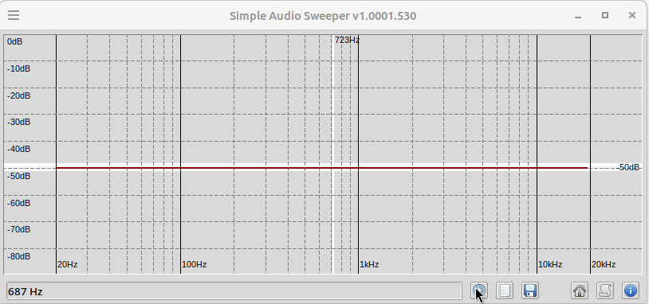

##  Simple Audio Sweeper
**A little helper for your DIY audio projects**

### Features:
- Simple generating any specific sound frequency
- Generating a frequency response graph of a PC audio system with a microphone and speakers
- Exporting results to image or csv file
- Importing csv file
- 8 separate buffers for comparing results
- Portability
- Live FFT graph with window function selection
- Input and output device selection

**Simple Audio Sweeper** uses the [sounddevice](https://python-sounddevice.readthedocs.io) module to interact with system audio hardware, and [NumPy](https://numpy.org/) for FFT analysis. The executable file is created with [Pyinstaller](https://pyinstaller.org). The GUI is built using [TkInter](https://docs.python.org/3/library/tkinter.html)

### Usage:
#### The microphone and speakers must be connected and configured. Audio from the speakers must be recorded by the microphone. ####

With mouse cursor on the frequency graph:

- hold down the left mouse button to generate a specific frequency
- right click (lock frequency)
- use mouse wheel or keyboard arrows to modify locked frequency
- run frequency sweep with action icon on the bottom

With keyboard:

- keys 1-8 to toggle visibility of specified samples buffer ('track')
- Ctrl to enable recording signal (modify 'track')
- arrows - modify locked frequency

Ensure silence during analysis. Do not allow any sound other than that emitted by the speakers to be recorded. The obtained characteristics will be the result of the characteristics of the microphone, loudspeakers and other components in the audio path, so for example when analyzing an amplifier with loudspeakers, the microphone used must have better parameters than them.

### Download:
Portable executable packages for **Linux** and **Windows** can be downloaded from the [Releases](https://github.com/PJDude/sas/releases).

### [Review on MAJORGEEKS](https://www.majorgeeks.com/files/details/simple_audio_sweeper.html)

### [Review on SOFTPEDIA](https://www.softpedia.com/get/Multimedia/Audio/Other-AUDIO-Tools/Simple-Audio-Sweeper.shtml)

### Supported platforms:

- Linux
- Windows (10,11)

### Licensing
- **Simple Audio Sweeper** is licensed under **[MIT license](./LICENSE)**

### False positives issue
[Reference to potential problems with Windows Defender and other antivirus programs](https://github.com/PJDude/dude/discussions/9).

### Check out my [homepage](https://github.com/PJDude) for other projects.
