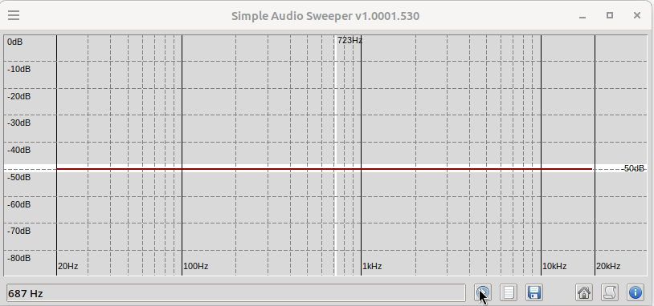
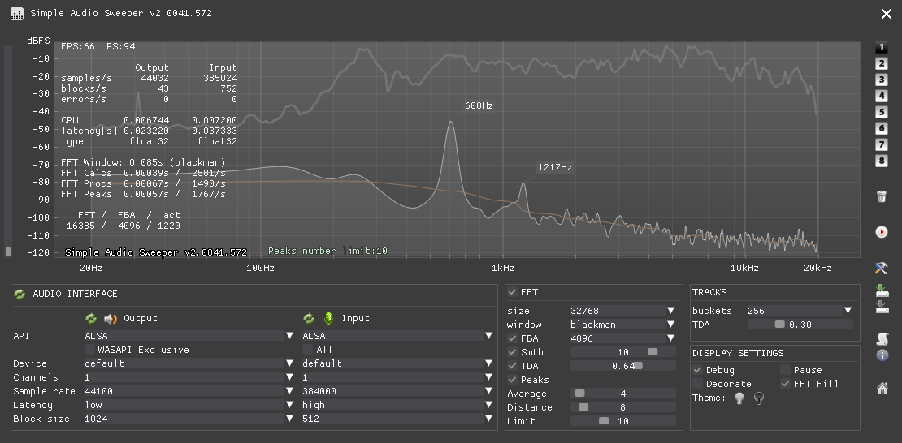

##  Simple Audio Sweeper
**A handy tool for DIY audio projects**

### Features
- Automatic and manual sweeping of the audio frequency spectrum to determine the system's frequency response
- Easy generation of any specific sound frequency to test audio equipment or identify unwanted resonances
- Live FFT graph with selectable FFT size, window functions, and post-processing stages
- Input and output device selection
- 8 separate spectrum buffers for result comparison
- Export of results to PNG or CSV files
- Portable
- Dark and light themes
- Automatic frequency peak detection

**Simple Audio Sweeper** uses the following libraries:
- [SoundDevice](https://python-sounddevice.readthedocs.io) — interaction with system audio hardware
- [NumPy](https://numpy.org/) — audio processing and FFT analysis
- [DearPyGui](https://dearpygui.readthedocs.io) — GUI framework
- [PyInstaller](https://pyinstaller.org) — building the portable executable

### Usage

> The microphone and speakers must be connected and configured. Audio from the speakers must be captured by the microphone.

With the mouse cursor on the frequency graph:

- Hold down the left mouse button to generate a specific frequency
- Right-click to lock the frequency
- Use the scroll wheel or arrow keys to adjust the locked frequency
- Start a frequency sweep using the action icon at the bottom

With keyboard:
| Key | Action |
|---|---|
| **1–8** | Toggle the visibility of the corresponding spectrum buffer (track) |
| **Ctrl** | Enable recording into the selected buffer (track) |
| **H** | Show help |
| **F12** | Toggle settings |
| **F11** | Toggle debug info |
| **F** | Toggle FFT |
| **F1 / F2** | About / License |
| **L / D** | Light / Dark theme |
| **V** | Toggle VSync |
| **P** | Toggle peak detection |
| **S / C** | Save screenshot / CSV |
| **Arrow keys** | Adjust the locked frequency |
| **F3 / Shift+F3** | Cycle FFT window function |
| **F4 / Shift+F4** | Cycle FFT size |
| **F5 / Shift+F5** | Cycle FFT frequency band averaging (FBA) |
| **F6 / Shift+F6** | Cycle FFT time domain averaging (TDA) |
| **F7 / Shift+F7** | Cycle track frequency bucket size |
| **F8 / Shift+F8** | Cycle track time domain averaging (TDA) |
|**space**| pause|

⚠️ Due to latency in the sound generation, propagation, capture, and analysis
chain, manually recording the spectrum with rapid mouse movements can produce
inaccurate, "lagged" results depending on the direction of movement. Accurate
measurements require slow, manual frequency adjustments or the use of the
automatic sweep, which is designed to operate at a controlled, steady pace.

### Troubleshooting

**FFT chart is enabled but flat**
- Check if a microphone or other input source is connected and selected.
  The Input icon should turn green when active.

**The sound is choppy and distorted**
- Enable debug information and verify that the OUT and IN sample rates
  match the selected devices' output and input sample rates.
  If they do not match, try:
  - Disabling VSync
  - Increasing the latency and block size of the devices
  - Reducing the number of active FFT processing stages or disabling it entirely

Ensure silence during analysis — only the sound emitted by the speakers should be recorded. The resulting characteristics will reflect the combined response of the microphone, speakers, and all other components in the audio path. For example, when analyzing an amplifier with speakers, the microphone's frequency response should be more accurate than that of the speakers being measured.

### Download
Portable executable packages for **Linux** and **Windows** can be downloaded from the [Releases](https://github.com/PJDude/sas/releases).

### [Review on MAJORGEEKS](https://www.majorgeeks.com/files/details/simple_audio_sweeper.html)

### [Review on SOFTPEDIA](https://www.softpedia.com/get/Multimedia/Audio/Other-AUDIO-Tools/Simple-Audio-Sweeper.shtml)

### Supported platforms:

- Linux
- Windows (10,11)

### Licensing
- **Simple Audio Sweeper** is licensed under **[MIT License](./LICENSE)**

### False positives issue
[Reference to potential problems with Windows Defender and other antivirus programs](https://github.com/PJDude/dude/discussions/9).

$~$

### Check out my [homepage](https://github.com/PJDude) for other projects!

